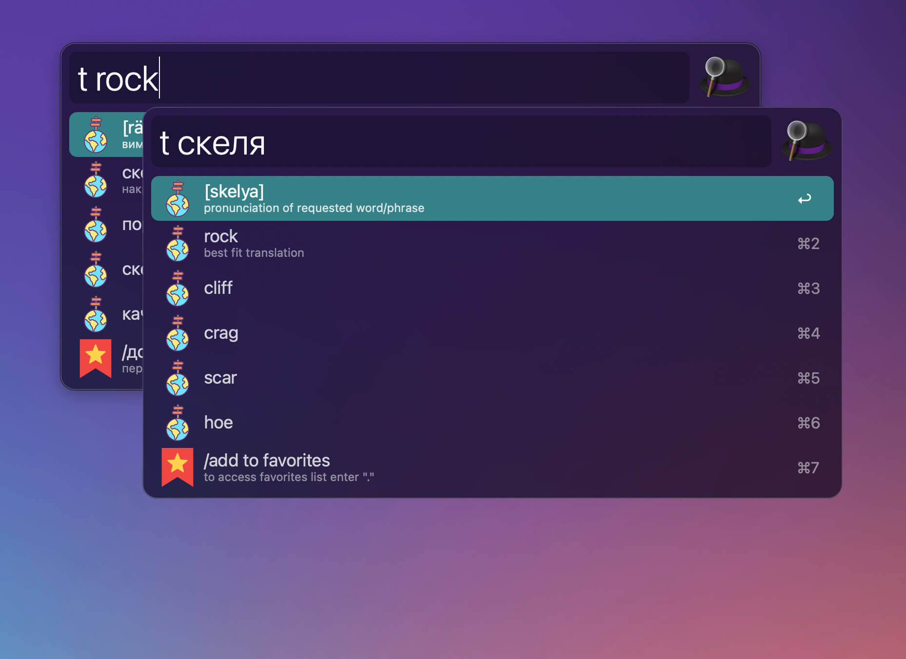

> After several years of active usage & support, this project came to it's end (mainly because of me migrating completely to Raycast). It was fun, educating & useful!

# alfred-translayta

![version] ![MIT][license] ![last-commit]

[version]: https://img.shields.io/npm/v/alfred-translayta
[license]: https://img.shields.io/badge/license-MIT-blue.svg
[last-commit]: https://img.shields.io/github/last-commit/dev99problems/alfred-translayta

> **Translate** with Google Translate in Alfred (*en-uk* / *uk-en*). **Save** to favorites. Practice **learning** the words.



Alfred Translayta is an ***Alfred workflow***, which lets you easily translate 🇺🇦 🔄 🇬🇧 , save words to favorites and have convenient way to review and memorize them later.

## Features
### Translation
* ***Auto-detection*** of the translation direction
* Correction of *misspelled words*
* Foremost app ***selected text translation***
* ***Pasting*** translation into the foremost app
* ***Copying*** translation into the clipboard
* ***Local caching*** of the last translation response

### Favorites 
* *Add/Edit/Delete* favorites
* *Learning* mode
* *Search* through normal/learning mode 
* *Import/Export* favorites from/to local file

## Prerequisites
* [Node.js 14](https://nodejs.org) or higher
* [Alfred (3,4,5)](https://www.alfredapp.com/)
* [Alfred Powerpack License](https://www.alfredapp.com/powerpack/)

## Install
```
$ npm install --global alfred-translayta
```

## Usage

Open Alfred and type `t` **or** press `Cmd+Shift+K` to activate workflow

<details><summary>Translate/Auto-correction</summary> 

* start typing phrase in English or Ukrainian

* hit `Enter` on list item with `auto-correction` suggestion

* enter `  ` (2 spaces) to get latest search results out of cache

* select any word of phrase and hit `Cmd-Shift-K` to get translation


</details>


<details><summary>Copy/Paste</summary> 

* navigate to any translation and hit `Enter` to copy to `clipboard`

* navigate to any translation and hit `Shift-Enter` to paste it into the `foremost` application


</details>


<details><summary>Favorites</summary> 

* navigate to the item named `/add` and hit `Enter` to add word to `Favs`

* to get access to your `Favs` list enter `.` in workflow, aka `t .`

* to edit/remove/copy any word from the list hit `Enter` on any item in your `Favs` list


</details>


<details><summary>Learning mode</summary> 

* to activate learning mode for your `Favs`, enter `..`, aka `t ..`

* in both `Favs` and `Learning` modes you can search by typing after `..`, 
e.g. `t ..brick` or `t .. brick` will filter the list

* in `Learning` mode you can navigate to any item and press and hold `Option` key to make it's translation visible


</details>


## HotKeys

`Cmd+Shift+K` — to open workflow main window

`Cmd+Shift+J` — to open favorites list (shortcut for `Cmd+Shift+K` + and entered `.`)


## Testimonials

**Visual** 
All icons are taken from [flaticon.com](https://www.flaticon.com/), so many kudos and thanks to [the authors](/icons/testimonials.md)

