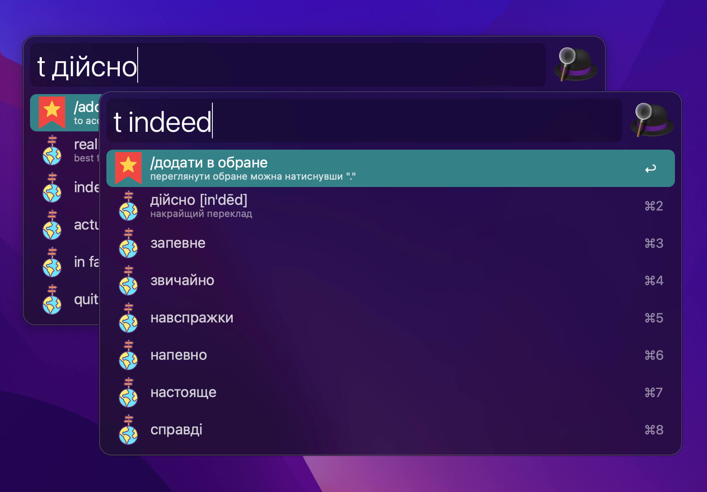
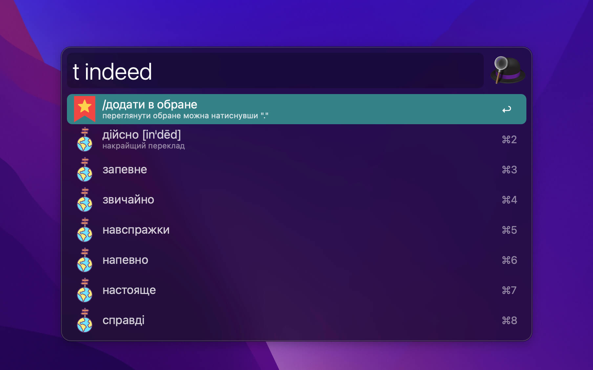
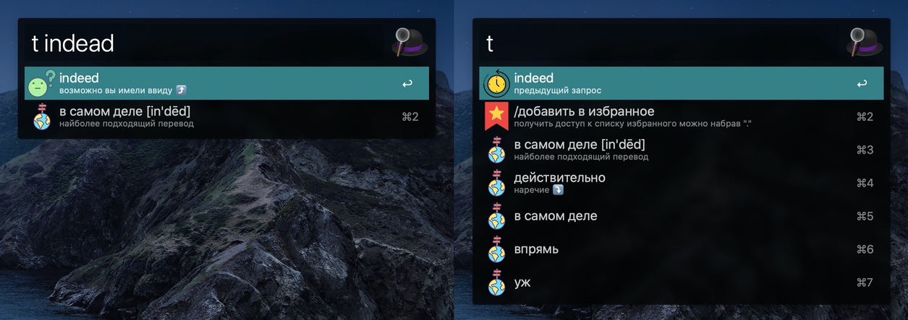
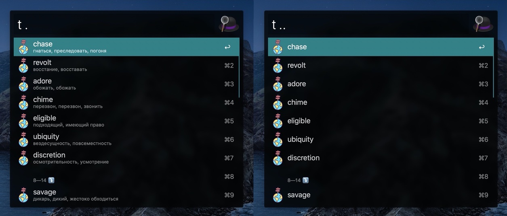

# alfred-translayta

> **Translate** with Google Translate in Alfred (*en-ru* / *ru-en*). **Save** to favorites. **Learn** unhandy words.



Alfred Translayta is an Alfred workflow, which let's you easily translate en-ru, ru-en pairs, add words to favorites and have convenient way to review and memorize them later.

## Features
### Translation
* Auto translate direction
* Auto correction of misspelled words 
* Get last translation details from the cache
* Translate selected text in OS

### Favorites 
* Add/Edit/Delete into favorites
* Switch to learning mode
* Search in normal/learning mode 
* Auto save favorites to a file on disk

## Prerequisites
You need [Node.js 8+](https://nodejs.org) and Alfred 3 or 4 with the paid [Powerpack](https://www.alfredapp.com/powerpack/) upgrade.

## Install
```
$ npm install --global alfred-translayta
```

## Usage

Open Alfred and type `t` **or** press `Cmd+Shift+K` and:
* **to get translation**:  
  - start typing words or phrases in english or russian
* **to get previous translation from cache**: 
  - press `spacebar`
* **access to favorites**: 
  - type `.`
* **show favorites without translations(aka "learning mode")**: 
  - type `..`
  - by pressing `Alt` button you can see translations of selected word

## HotKeys

`Cmd+Shift+K` — to open workflow main window

`Cmd+Shift+J` — to open favorites list (shortcut for `Cmd+Shift+K` + and entered `.`)


## Screenshots







## How it is different
There are a lot of more popular alfred workflows for translation.
I really like 2 of them:
* [alfred-translate](https://github.com/podgorniy/alfred-translate) — ideological inspiration (`python` + `yandex translate`). The problem for me here is all `yandex` services are restricted in Ukraine. Plus some `python` errors after a few translations while using VPN(maybe this is just a local problem).
* [alfred-polyglot](https://github.com/nikersify/alfred-polyglot) — technical inpiration (`node` + `google translate`). **Alfred-polyglot** is really cool, you can translate to any language or set default translation pair, but the translations are restricted to only 1 option and really often it was not a best fit.

> The best code is no code at all

**Why another solution?** It was an idea to mix both solutions and to get the best features of each: auto lang. detection, multiple options for translation and of course `favorites list`.

Moreover, `favorites` was the main feature I needed so bad. There are plenty of difficult words for me, `which I translate over and over and still can't remember their meaning and translation`. Instead I would really like to have a place for all these words, which I could access even when my laptop is offline. So here it is!

## Testimonials

**Tech**
Inspired by [alfred-translate](https://github.com/podgorniy/alfred-translate) and [alfred-polyglot](https://github.com/nikersify/alfred-polyglot).
Based on [Alfy](https://github.com/sindresorhus/alfy) and [google-translate-api](https://github.com/vitalets/google-translate-api) 

**Visual** 
All icons are taken from [flaticon.com](https://www.flaticon.com/) and huge thanks to [all authors listed here](/icons/testimonials.md)

